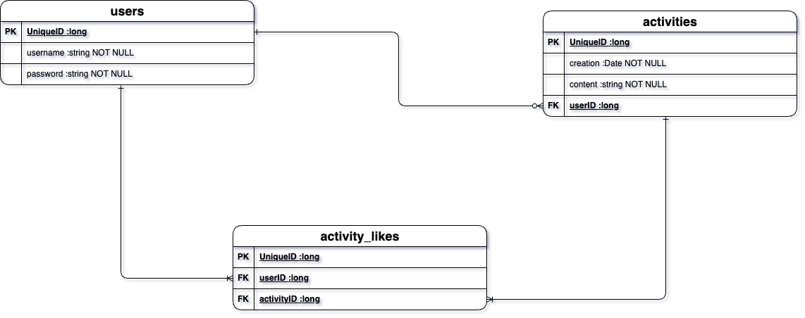

# Active - Spring Boot API Application

This application is a back end focus social media API. The endpoints may resemble other platforms for its functionalities. As this project scale, the endpoints will showcase how unique it can be. This program is one of two parts for the full stack application. It requires my front end SPA application linked [here](https://github.com/t-hendricks/active-angular-app) in order to make http requests and load data from a browser.

## Initial Approach

My motto when learning any new subject or developing new ideas is 'function over fashion'. I want the endpoints to be robust and dynamic. So I kept my initial plan as simple as possible to reduce scope creep.

### ERD

### User Stories
- As an unregistered user, I should be able to register, so I can login with my unique credentials.
- As a registered user, I should be able to login with my credentials, so I can interact with the web application.
- As a logged-in user, I should be able to post an activity, so other users can interact with it.
- As a logged-in user, I should be able to see random activities, so I can like the random activities.

### Endpoints
| Request Type | URL                          | Functionality                                | Access  |
|--------------|------------------------------|----------------------------------------------|---------|
| POST         | /auth/users/register         | New user sign up with new unique credentials | Public  |
| POST         | /auth/users/login            | Registered user logs in with credentials     | Public  |
| POST         | /api/activities              | Creates a new activity                       | Private |
| PUT          | /api/activities/{activityId} | Updates an existing activity by id           | Private |
| GET          | /api/activities              | Get a random activity                        | Private |
| POST         | /api/activities/{activityId} | Adds a like to an existing activity          | Private |
| DELETE       | /api/activities/{activityId} | Removes a like from an existing activity     | Private |
| GET          | /api/user/activities         | Gets logged-in user content                  | Private |

## Technologies Used
- ### Version control:
    - 
    - 
- ### Developer Tools:
    - 
- ### Programming:
    - 
    - 
- ### Security:
  - 
  - 

## Future Plans
- Refactor models to access JSON data

## Resources
These are general websites that helped me pass most of my roadblocks.
- [Stack Overflow](https://stackoverflow.com/)
- [Baeldung](https://www.baeldung.com/)
- [Medium](https://medium.com/)
- General Assembly's Lessons

## Credits
Developers that I'm grateful for helping my initial accomplishments.
- [Suresh](https://github.com/sureshmelvinsigera/)
- [Leo](https://github.com/LRodriguez92)
- Dhrubo
